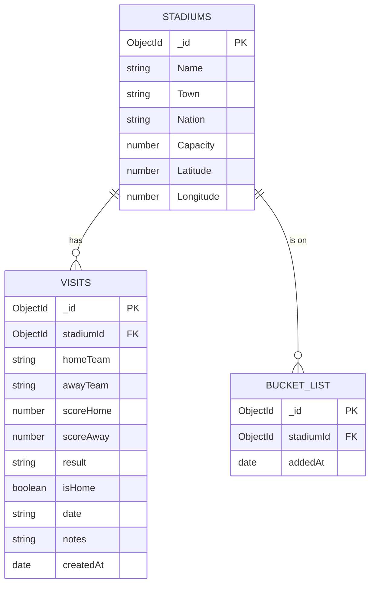

```mermaid
erDiagram
    STADIUMS {
        ObjectId _id PK
        string Name
        string Town
        string Nation
        number Capacity
        number Latitude
        number Longitude
    }

    VISITS {
        ObjectId _id PK
        ObjectId stadiumId FK
        string homeTeam
        string awayTeam
        number scoreHome
        number scoreAway
        string result
        boolean isHome
        string date
        string notes
        date createdAt
    }

    BUCKET_LIST {
        ObjectId _id PK
        ObjectId stadiumId FK
        date addedAt
    }

    STADIUMS ||--o{ VISITS : "has"
    STADIUMS ||--o{ BUCKET_LIST : "is on"
```